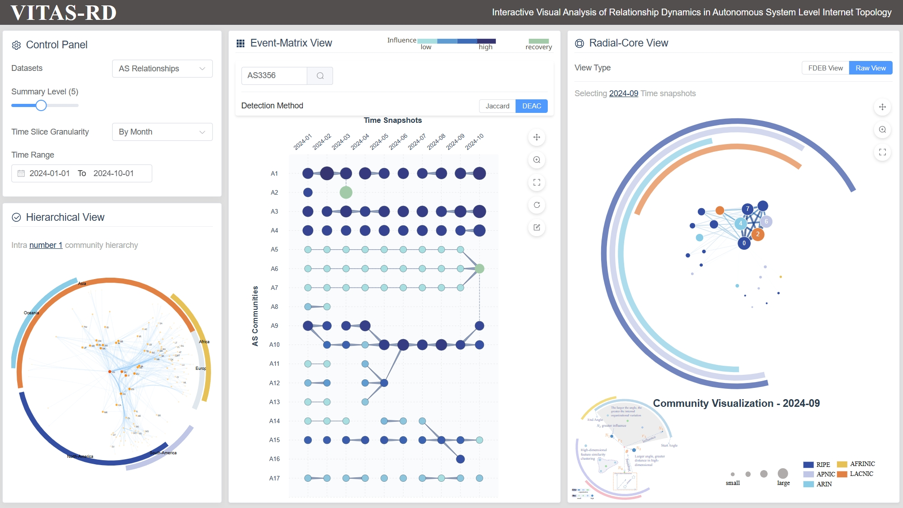

# VITAS-RD: Interactive Visual Analysis of Relationship Dynamics in Autonomous System Level Internet Topology

## Introduction
VITAS-RD is an independent visualization tool specifically designed for the interactive analysis of AS network dynamics.  
In this repository, you can explore the entire system workflow, including data collection, processing, and visualization, as well as the methodology and logic behind event classification.  
In addition, an online demo is available for you to quickly access and experience the tool.

The goal of this tool is to help researchers and engineers gain a more intuitive understanding of the evolution and dynamics of relationships between ASes, thereby supporting network structure research, anomaly detection, and operational analysis.

---

## Online Demo and Video

- [**Online Demo**](https://zjutvis.github.io/VITAS-RD/)  
  This demo provides an interactive environment where users can directly explore AS-level topological dynamics.  
  It allows intuitive access to the **Event-Matrix** and **Radial-Core** visualizations without any local installation, serving as a quick entry point to experience the system’s capabilities.  

  

- **Demo Video**  
  A short demonstration video is provided for users who prefer a guided overview of the system’s workflow and major features.  
  The video plays directly in the current directory for convenience:  

[🎬 Demo Video](./VITAS-RD-demo.mp4)

---

## Code Usage

### Install
```bash
pip install -U networkx numpy pandas matplotlib
````

### Influence aggregation and radius mapping

```python
from util import node_influence
import networkx as nx
import pandas as pd

G = nx.DiGraph()
# ... construct nodes/edges ...

# rank: DataFrame with columns ['id', 'cone', 'community'] (pagerank added internally)
rank = pd.DataFrame([
    # {'id': ..., 'cone': ..., 'community': ...},
])

# superNode: one row per community
superNode = pd.DataFrame([
    # {'community': ...},
])

superNode = node_influence(G, rank, superNode)
# Produces columns: influence, log_influence, radius
```

### Community-level topological features mapped to `superNode`

```python
from util import node_topo_features

# partition: dict[node_id -> community_id]
partition = {
    # node_id: community_id,
}

superNode = node_topo_features(G, partition, superNode)
# Adds: rich_club, k_core, clustering, betweenness, structural_entropy
```

### Angle evolution visualization (monthly snapshots)

```python
from util import create_supernode_evolution_visualization

dates = [f"20240{i}" for i in range(1, 10)] + ["202410"]
create_supernode_evolution_visualization(dates)
# Output: visualization/assets/data/images/community_angle_evolution.png
```

---

## Note

### Data layout and assumptions

* Monthly inputs expected at `visualization/assets/data/<YYYYMM>/handle/`.
* Visualization expects `superNode_with_angle.csv` with at least `community` and `angle`;
  `organization`, `size`, and `distance` are optional but recommended.
* Influence computation expects `rank` with columns `id`, `cone`, `community`; PageRank is derived from the given graph.

### Reproducible analysis pipeline (notebooks)

* `notebooks/01.data_alignment.ipynb` (align `rank`/`rel` IDs)
* `notebooks/02-1.rank_country_code_completion.ipynb`
* `notebooks/02-2.weight_encoding.ipynb`
* `notebooks/03-1.community_detection.ipynb`
* `notebooks/03-2.generate_community_info.ipynb`
* `notebooks/03-3-1.community_events.ipynb`, `notebooks/03-3.community_events.ipynb`
* `notebooks/04-1-1.event_format_single_community_process.ipynb`, `notebooks/04-1.draw_matrix.ipynb`, `notebooks/04-2.fill_event_matrix.ipynb`
* `notebooks/04-3.supernode_processing.ipynb`, `notebooks/04-4.superlink_processing.ipynb`, `notebooks/04-5.supernode_for_interaction.ipynb`
* `notebooks/05-1.ascore_data_preparation.ipynb`

### Environment

* Python 3.9+
* Required packages: `networkx`, `numpy`, `pandas`, `matplotlib`

---

## Datasets

The system is built on publicly available AS-level datasets provided by **CAIDA**:

* **ASRank** ([API Documentation](https://api.asrank.caida.org/v2/restful/doc))
  ASRank provides **ranking and organizational information** for Autonomous Systems based on metrics such as customer cone size, degree centrality, and interconnectivity.
  It is used in VITAS-RD to characterize the hierarchical role of ASes and enrich node-level attributes for community detection and visualization.

* **AS Relationships** ([CAIDA Dataset](https://www.caida.org/catalog/datasets/as-relationships/))
  This dataset **infers business relationships** (e.g., provider-to-customer, peer-to-peer) between ASes using BGP data and heuristics such as the **valley-free assumption**.
  Since AS relationships are commercially sensitive and rarely disclosed by operators, this dataset serves as the *de facto* standard in network research despite its inferential nature.
  It provides the foundation for studying **structural patterns and temporal dynamics** in VITAS-RD.

